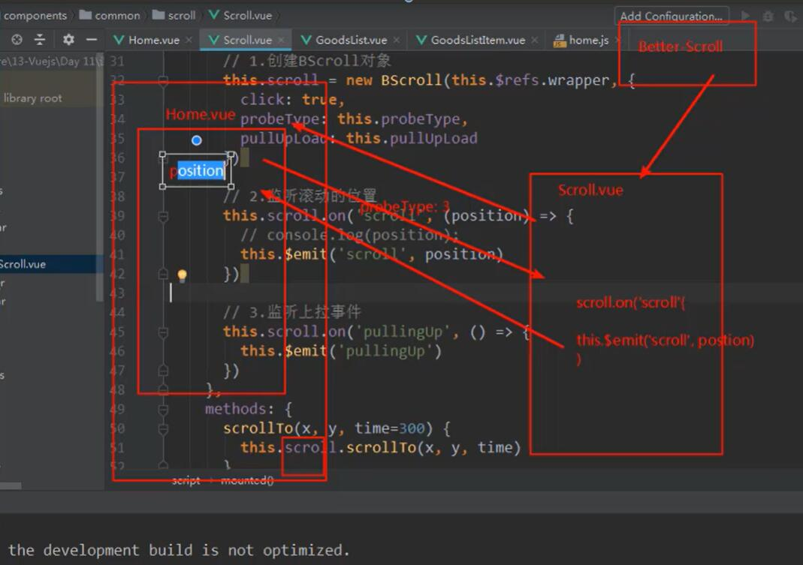
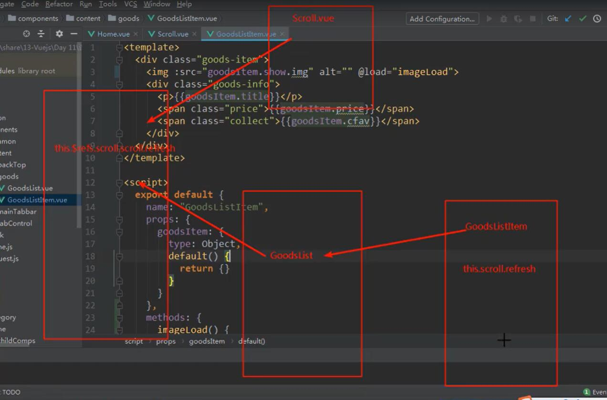

# demo1

## Project setup
```
npm install
```

### Compiles and hot-reloads for development
```
npm run serve
```

### Compiles and minifies for production
```
npm run build
```

### Lints and fixes files
```
npm run lint
```

## 项目基本思路

### 一、划分项目目录

------

```
-/
	-node_modules
	-public
	-src
		-assets
		-components
		-network
		-router
		-store
		-views
		-App.vue
		-main.js
	-.editorconfig
	-.gitignore
	-package.json
	-vue.config.js
	-babel.config.js
	
	
```

### 二、 引入assets/css/normalize.css和base.css

### 三、配置.editorconfig和vue.config.js

- > .editorconfig      ---->风格统一

  ```
  root = true
  
  [*]
  charset = utf-8
  indent_style = space
  indent_size = 2
  end_of_line = lf
  insert_final_newline = true
  trim_trailing_whitespace = true
  ```

  - > vue.config.js		----->省略路径

  ```
  module.exports = {
      configureWebpack: {
        resolve: {
          alias: {
            'assets': '@/assets',
            'common': '@/common',
            'components': '@/components',
            'network': '@/network',
            'views': '@/views',
          }
        }
      }
    }
  ```

### 四、自己封装TabBar组件，用到的技术

1. 插槽

2. vue-router 懒加载路由模式

3. 父组件向子组件传值

4. flex布局

5. ```
   重要代码  ---->tabbaritem.vue
   <template>
     <div class="tab-bar-item" @click="itemClick">
       <div v-if="!isActive">
         <slot name="item-icon"></slot>
       </div>
       <div v-else>
         <slot name="item-icon-active"></slot>
       </div>
       <div :style="activeStyle">
         <slot name="item-text"></slot>
       </div>
     </div>
   </template>
   
   <script>
   export default {
     name: "TabBarItem",
     props: {
       path:String,
       activeColor:{
         type:String,
         default:'#ff256d'
       }
     },
     data() {
       return {
         //isActive: true
       }
     },
     computed:{
       isActive() {
       //
         return this.$route.path.indexOf(this.path)!== -1;
       },
       activeStyle(){
         return this.isActive ? {color:this.activeColor} : {}
       }
     },
     methods: {
       itemClick() {
         // eslint-disable-next-line no-console
         this.$router.replace(this.path) 
       }
     }
   };
   </script>
   
   <style scoped>
   .tab-bar-item {
     flex: 1;
     text-align: center;
     height: 49px;
     font-size: 14px;
   }
   .tab-bar-item img {
     width: 24px;
     height: 24px;
     vertical-align: middle;
     margin-top: 3px;
     margin-bottom: 2px;
   }
   
   </style>
   ```

### 五、封装NavBar组件

1. 插槽
2. flex布局

### 六、封装Swiper组件和封装网络组件

1. 网络组件的封装

   ```js
   
   import axios from 'axios'
   export function request(config) {
   
       const instance = axios.create({
           baseURL: 'http://123.207.32.32:8000/api/hy',
           timeout: 5000
       })
       instance.interceptors.request.use(config => {
           // console.log('来到了request拦截success中');
           // 1.当发送网络请求时, 在页面中添加一个loading组件, 作为动画
           // 2.某些请求要求用户必须登录, 判断用户是否有token, 如果没有token跳转到login页面
           // 3.对请求的参数进行序列化(看服务器是否需要序列化)
           // config.data = qs.stringify(config.data)
           // console.log(config);
           return config
       }, err => {
           // eslint-disable-next-line no-console
           console.log(err)
       })
       instance.interceptors.response.use(res => {
           return res.data
       }, err => {
           // eslint-disable-next-line no-console
           console.log(err)
       })
       return instance(config)
   }
   ```

2. 父组件向子组件传值 props

### 七、封装recommends组件

### 八、封装featureview组件

### 九、封装tabcontrol组件

1. flex布局

2. 父子组件传值

3. 动态绑定class类

4. ```
   点击哪个哪个高亮显示，
   实现思路：
   1.先在data属性中定义一个 currentInde=0
   2.v-for里面记录当前的index
   3.给标签定义一个动态的class类：---->  :class="active:currentIndex === index"
   4.给标签绑定一个点击事件 @click="itemClick(index)"
   5.methods属性中添加点击事件
   	 itemClick: function(index) {
         // 1.改变currentIndex
         this.currentIndex = index;
       }
   ```

### 十、goods列表的封装和数据的获取

1. 数据的封装

2. ```
   goods:{
   	'pop':{page:1,list:[]},
   	'new':{page:1,list:[]},
   	'sell':{page:1,list:[]}
   }
   ```

3. ```js
   //network模块
   export function getHomeGoods(type,page){
       return request({
           url:"/home/data",
           props:{
               type,
               page
           }
       })
   }
   //home模块
   /*type,page是要传的参数*/
   如何调用呢？
   created:{
       this._getHomeGoods('pop');
       this._getHomeGoods('new');
       this._getHomeGoods('sell');
   }
   methods:{
       _getHomeGoods(type){
         let page = this.goods[type].page + 1 ;
         getHomeGoods(type,page).then(res => {
           let data = res.data.list
            this.goods[type].list.push(...data)
            this.goods[type].page += 1
         })
       }
   }
   /*根据类型的不同去获取不同的数据*/
   ```

4. 封装goodsList组件

   1. 通过props进行传值：

   2. > :goods=“goods[‘pop’].list”

5. 封装goodslistitem组件

   1. >  父组件的item为一个对象，给子组件传值时用的是 :goodsListItem=“item”

6. tabcontrol点击切换商品------>逻辑

   1. > 分析：tabcontrol的点击是发生在组件内部的，外面想用的话必须传递到外面去

   2. > 如何传输呢？通过子组件向父组件传值

      ```
      methods:{
      itemClick: function(index) {
            // 1.改变currentIndex
            this.currentIndex = index;
            //2.
            this.$emit('$tabClick',index)
          }
      ```

   3. > 外面的也要进行接收 在需要的标签处进行事件绑定
      >
      > ```
      > @tabClick="tabClick",
      > 在方法里面定义
      > tabClick(index){
      >       // eslint-disable-next-line no-console
      >       console.log(index)
      >     },
      > 这样就能拿到从tabControl里传递过来的index
      > ```
      >
      
   4. 拿到了tabcontrol里传递过来的值
   
      ```
      可以在data里面定义一个数据：  currentType:'pop',
      然后在
      tabClick(index){
         switch(index){
              case 0 :
                this.currentType = 'pop'
                break;
              case 1 :
                this.currentType = 'new'
                break;
              case 2 : 
                this.currentType = 'sell'
                break
            }
       },
       动态的判断点0传pop，点1传new，
       然后在<goods-list :goods="goods[currentType].list"/>
       把currentType变量放进去
      ```
   
   5. 如果标签的值太长，建议使用计算属性去保存

### 十一、Better-scroll的使用

> 前因：因为better-scroll每个界面都可能会引用，并且对他的依赖性的不能太强，万一他jj，只改一个组件就好了

> ref：如果是绑定在组件中的，那么通过`this.$refs.refname`获取到的是一个组件对象
>
> ​	 ：如果绑定在普通的元素中，那么通过`this.$refs.refname`获取到的是一个元素对象

### 1. 初步封装

1. ​	安装插件  ` npm i  better-scroll  --Save`

2. ​    在公共组件中创建scroll目录和scroll.vue文件

3. ​    第一步导入 `import BScroll from 'better-scroll';`

4. 创建better-scroll的实例

   1. ```
       data () {
            return {
                scroll:null
            };
          },
          mounted(){
              this.scroll = new BScroll(this.$refs.wrapper,{
                  
              })
          }
          
          this.$refs.wrapper可以拿到这个.wrapper元素
      ```

5. ```
   <template>
     <div class="wrapper" ref="wrapper">
       <div class="content">
           <slot></slot>
       </div>
     </div>
   </template>
   better-scroll 的使用必须需要包裹两个div，一个是wrapper，一个是content
   ```

6. 在组件中使用这个scroll组件

   1. 导入 scroll这个组件，注册组件

   2. 在需要滚动的地方套上scroll标签

   3. ```html
      1. <scroll class="content">
      2. 需要滚动的组件
      3. </scroll>
      ```

   4. 要个content加个高度便可初步使用
   
7.  ### backTop组件的封装

   1. 封装组件：用到固定定位

   2. 功能：点击按钮滚动到上面：分析：要获取scroll距离顶部的高度

   3. 具体实现：

      1. 点击图标回到顶部；先给图标注册一个点击事件

      2. 

      3. 因为back-top组件内创建一个监听事件，在发射到外面使用，就比较麻烦，所以直接在外面使用@click.native这个属性，就可以监听原生组件的点击事件了,在  <back-top @click.native="bakcClick"/>

      4. 因为要使用scroll组件中scroll对象的方法，所以要用$ref这个东西

      5. ```
         在backClick(){
         	  this.$refs.scroll.scroll.scrollTo(0,0,300)
         }
         就可以在home组件使用scroll内的方法了
         ```

      6. 给backTop做个达到某一位置才会显示，具体实现

         1. 首先先在子组件scroll中，把betterscroll组件的监听滚动位置的方法通过自定义事件的形式发送出去

         2. ```
              mounted(){
                  //创建better-scroll对象
                    this.scroll = new BScroll(this.$refs.wrapper,{
                        click:true,
                        probeType:this.probeType
                    })
                    //监听滚动的区域
                   this.scroll.on('scroll',(position) => {
                     // eslint-disable-next-line no-console
                     this.$emit('scroll',position)
                     //通过$emit(子组件向父组件传值把东西发射出去)
                   })
               
                },
            ```

         3. 通过v-show指令去判断他的位置进行显示或隐藏

         4. ```
            <back-top 
                    @click.native="bakcClick" 
                    v-show="isShowBackTop"/>
            data(){
                return{
            		isShowBackTop
                }
            }
            methods:{
             	contentScroll(position){
                  // eslint-disable-next-line no-console
                  this.isShowBackTop = (-position.y) > 1000
                },
            }
            ```

      7. 完成下拉加载更多的功能

         1. 分析：监听上拉事件，滚动到底部的时候，加载更多的数据
         2. 功能实现: 监听上拉事件

   ### 知识回顾
   
   	#### 一、FeatureView
   
   - ​	独立组件封装FeatureView
     - div > a >img
   
   #### 二、TabControl
   
   #### 三、首页商品数据的请求
   
   	##### 3.1设计数据结构，用于保存数据
   
   - ```
     goods:{
     	pop:{page:0,list:[]},
     	new:{page:0,list:[]},
     	sell:{page:0,list:[]}
     }
     ```
   
   ##### 3.2发送数据请求
   
   - 在home.js中封装getHomeGoods(type,page)
   
   - 在Home.vue中,又在methods中getHomeGoods(type)
   
   - 调用getHomeGoods(‘pop’)/getHomeGoods(‘new’)/getHomeGoods(‘sell’)
   
     - page:动态的获取对应的page
   
   - 获取到数据：res
   
     - this.goods[type].list.push(...res.data.list)
     - this.goods[type].page += 1
     
   - ```
     goods:{
     	pop:{page:1,list:[30]},
     	new:{page:1,list:[30]},
     	sell:{page:1,list:[30]}
     }
     ```
   
   
   
   #### 四、对商品数据进行展示
   
   ##### 4.1封装GoodsList.vue
   
   - props:  goods  --> list[30]
   - v-for goods --->GoddsListItem[30]
   - GoodListItem(组件)-------->GoodsItem(数据)
   
   ##### 4.2 封装GoodsListItem.vue组件
   
   - props：goodsItem
   - goodsItem取出数据，并且使用正确的div/span/
   
   #### 五、对滚动进行重构：Better-scroll
   
   ##### 5.1	在index.html中使用Better-Scroll
   
   - ​	const bscroll = new BScroll(el,{})
   - 注意：wrapper    ---->content  ---->很多内容
   - 1.监听滚动
     - probe Type：0/1/2(手指滚动)/3(只要是滚动)
     - bscroll.on(‘scroll’,position => {})
   - 2.上拉加载
     - pullUpLoad:ture
     - bscroll.on(‘pullingUp’,() =>{})
   - 3.click:flase
     - button可以监听点击
     - div不可以
   
   ##### 5.2vue项目中使用 Better-Scroll
   
   - 在Profile.vue中简单的演示
   - 对Better-Scroll进行封装：scroll.vue
   - Home.vue和scroll.vue之间进行通信
     - Home.vue将probeType设置为3
     - scroll.vue需要通过$emit,实时将事件发送到Home.vue
   
   
   
   #### 六、回到顶部BackTop
   
   ##### 6.1对BackTop.vue组建的封装
   
   ##### 6.2如何监听组建的点击
   
   - 直接监听back-top的点击，但是可以直接监听？
     - 不可以的，必须添加.native的修饰符
   - 回到顶部
     - scroll对象，scroll.scrollTo(x,y,time)
     - this.$refs.scroll.scrollTo(0,0,500)
   
   ##### 6.3 BackTop组件的显示和隐藏
   
   - ​	isShowBackTop:false
   - 监听滚动，拿到滚动的位置：
     - -position.y >1000 ----->isShowBackTop:true
     - isShowBackTop =(-position.y) >1000
   
   **------------------------------------------------回顾结束-------------------------------------------------**
   
   #### 十二、解决better-scroll的可滚动区域的大BUG
   
   - Better-Scroll在决定有多少区域可以滚动时，是根据scrollerHeight属性决定的
   
     -  scrollerHeight属性是根据放在Better-scroll的content中的子组件的高度决定的
     - 但是我们的首页中，刚开始在计算scrollerHeight属性时，是没有将图片计算在内的
     - 所以，计算出来的结果是错误的
     - 后来图片加载进来之后有了新的高度，但是scrollerHeight属性并没有更新
     - 所以滚动出现了问题
   
   - 如何解决这个问题了？

     - 监听每一张图片是否加载完成，只要有一张图片加载完成了，执行refresh()
     
     - 如何监听图片加载完成呢？
     
       - 原生js的监听图片：img.onload = function(){}
       - vue有一个事件  @load
       - 所以给img 添加这个事件 @load=“imageLoad”
     
     - 如何在home.vue组件中监听到goodsListItem的图片加载事件呢？这里两个组件并不是父子组件，如何传值呢？
     
     - 
     
     - 这里可以通过  事件总线   `$bus`来解决
     
       - 第一步：在goodsListItem.vue组件中将@load=“imageLoad”这个事件发送出去
     
       - ```
         methods:{
             imageLoad(){
               this.$bus.$emit('itemImageLoad')
             }
           }
           
          
         ```
     
       - 第二步：在home.vue组件中接收这个发送出来的`itemImageLoad`
     
       - ```
         this.$bus.$on('itemImageLoad',()=>{
                 // eslint-disable-next-line no-console
                 console.log('-----------')
                 this.$refs.scroll.refresh()
             })
         ```
     
       - 第三步：在main.js中要在原型上激活这个事件总线
     
         - Vue.prototype.$bus = new Vue()
     
       - 就可以拿到@load了

### 十二、对于refresh非常频繁的刷新问题，进行防抖操作

- ​	debounce  防抖函数

- ​    throttle       节流函数

- 防抖函数起作用的过程

  - 如果我们直接执行refresh，那么refresh函数会被执行30次
  - 可以将refresh函数传到 	debounce 函数中,生成一个新的函数
  - 之后调用合唱频繁的时候，就使用新生产的函数
    - 而新生成的函数，不会非常频繁的调用，如果下一次执行

- 封装一个防抖函数

- ```
   debounce(func,delay) {
        let timer =null
        return function(...args){
          if(timer) clearTimeout(timer)
          timer = setTimeout(()=>{
              func.apply(this,args)
          },delay)
        }
      },
  ```

- 调用

- ```
  const refresh  = this.debounce(this.$refs.scroll.refresh,200)
      this.$bus.$on('itemImageLoad',()=>{
         refresh()
      })   //闭包不会对变量销毁
  ```


### 十三、TabControl的吸顶效果

#### 13.1 获取到tabControl的offsetTop(所有组件都有一个属性$el:用于获取组件的元素)

1. 必须知道滚动到多少时，开始有吸顶效果，这个时候就需要获取tabControl的offsetTop
2. 但是，如果直接在mounted中tabControl的offsetTop，那么值是不正确的
3. 如何获取正确的值？
   1. 监听homeSwiper轮播图图片的加载
   2. 加载完成后，发出事件，在Home.vue中获取正确的值
   3. 补充：
      1. 为了不让HomeSwiper多次发出事件，
      2. 可以使用isLoad的变量进行状态的记录
   4. 注意：这里不进行多次多次调用，

#### 13.2 监听滚动，复制一份tabControl给其绑定个v-show，到位置了再让它显示

​	bug：两个tabControl的index值不一致

​	解决：第一个为tabControl1，第二个为tabControl2，

```js
在  tabClick(index) {
this.$refs.tabControl1.currentIndex = index;

  	   this.$refs.tabControl2.currentIndex = index;

}
```

```
 swiperImageLoad(){
    //1.获取tabControl的offsetTop
    this.tabOffsetTop = this.$refs.tabControl2.$el.offsetTop
    },
```

### 十四、 让Home保持原来的状态

#### 14.1 让home不要随意销毁掉

- keep-alive

#### 14.2让Home保持原来的位置

- 离开时，保存一个位置信息saveY
- 进来时，将为值设置为原来保存的位置saveY信息即可

### 十五、 详情页实现思路

#### 1、点击商品进入详情页

1. 给goodsListItem 组件添加点击事件 @click = “itemClick”

2. 创建detail组件，给detail组件配置路径

3. ```
    this.$router.push({
     path:'/detail',
     query:{
       iid:this.goodsItem.iid
     }
   })
   通过路由将商品的iid传递出去
   ```

#### 2、详情页导航栏实现

- ​	返回按钮：left
- 标题列表的展示：center

#### 3、请求详情数据

- ​	接口：/detail?iid=

#### 4、轮播图的实现

- ​	Swiper/SwiperItem

#### 5、获取商品详情信息,商品信息展示

- ​	数据来自四面八方，对数据进行汇总：一个对象当中

```js
 export class Goods {
    constructor(itemInfo, columns, services) {
      this.title = itemInfo.title;
      this.desc = itemInfo.desc;
      this.newPrice = itemInfo.price;
      this.oldPrice = itemInfo.oldPrice;
      this.discount = itemInfo.discountDesc;
      this.columns = columns;
      this.services = services;
      this.nowPrice = itemInfo.highNowPrice;
    }
  }

```


#### 6、[混入]([https://cn.vuejs.org/v2/guide/mixins.html#%E5%85%A8%E5%B1%80%E6%B7%B7%E5%85%A5](https://cn.vuejs.org/v2/guide/mixins.html#全局混入))

- ​	创建混入对象：const mixin = {}
- ​    组件对象中：mixins：[mixin]

#### 7、标题和内容联动效果

- ​	点击标题，滚动到对应的主题
  - 在detail中监听标题的点击，获取index
  - 滚动到对应的主题：
    - 获取所有主题的offsetTop
    - 问题：在那里获取到正确的offsetTop
      - 1.created肯定不行，压根不能获取元素
      - 2.mounted也不行，数据还没有获取到
      - 3.获取到数据的回调中也不行，DOM还没有渲染完
      - 4.$nextTick也不行，因为图片的高度没有被计算在内
      - 5.在图片加载完成后，获取的高度才是正确的
- 

#### 8、底部工具栏，点击加入购物车

#### 9、回到顶部


